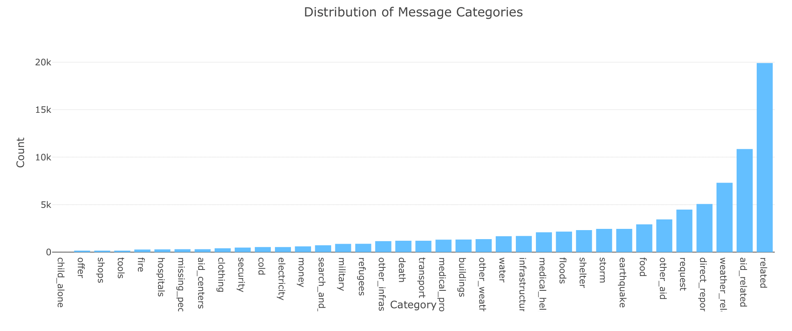

# Disaster Response Pipeline 



    Project Main Page


### Table of Contents

1. [Installation](#installation)
2. [About the Project](#motivation)
3. [File Descriptions](#files)
4. [Results](#results)

## Installation <a name="installation"></a>

1. Dependencies needed. Use `pip install <dependency>` 
    - Machine Learning Libraries: Numpy, Pandas, Sklearn
    - Natural Language Process Libraries: NLTK
    - SQLlite Database Libraries: SQLalchemy
    - Web App and Data Visualization: Flask, Plotly
    
2. Run the following commands in the project's root directory to set up your database and model.

    - To run ETL pipeline that cleans data and stores in database
        `python data/process_data.py data/disaster_messages.csv data/disaster_categories.csv data/DisasterResponse.db`
    - To run ML pipeline that trains classifier and saves
        `python models/train_classifier.py data/DisasterResponse.db models/classifier.pkl`

3. Run the following command in the app's directory to run your web app.
    `python run.py`

4. Go to http://0.0.0.0:3001/

## About the Project<a name="motivation"></a>
This project is about analyzing message data for disaster response. The data gotten from Figure Eight is used to build a model that classifies disaster messages and web app where an respondent can input a new message and get classification results in several categories 

## File Descriptions <a name="files"></a>
```
disaster_response_pipeline
          |-- app
                |-- templates
                        |-- master.html         # Main page of the web app
                        |-- go.html             # Classification result page of the web app
                |-- run.py                      # Script for the app
          |-- data
                |-- disaster_message.csv        # Mesage Data
                |-- disaster_categories.csv     # categories Data
                |-- DisasterResponse.db         # Clean Data
                |-- process_data.py             # script for building an ETL pipeline and data cleaning
          |-- models
                |-- classifier.pkl              # saved model -> Random forest 
                |-- train_classifier.py         # script for building a ML pipeline (there is also AdaBoost model setup)

          |-- README
```
## Results<a name="results"></a>


